Time Series Analysis and Forecasting for Technical Olympic S.A. Stock
Closing Values
================

<p>
This project involves a comprehensive time series analysis and
forecasting endeavor focused on the closing values of Technical Olympic
S.A. stock. The dataset, representing historical stock prices, is loaded
and preprocessed using the R programming language. The analysis
encompasses various stages, including time series decomposition to
uncover trends, seasonality, and residuals. Additionally, a polynomial
approach is applied to explore the fit of polynomial models of different
degrees. The Box-Cox transformation is employed to stabilize variance,
and the Box-Jenkins method, involving the Augmented Dickey-Fuller and
KPSS tests, is used to address stationarity and identify optimal
parameters for ARIMA modeling. The project concludes with the fitting of
ARIMA models, diagnostic checks of residuals, and the generation of
forecasts for future stock closing values. Through these analytical
steps, the aim is to provide insights into the underlying patterns of
Technical Olympic S.A. stock prices and to make informed predictions for
future market behavior.
<p>

``` r
# Loading required packages
library(knitr)
library(stats)
library(MARSS)
library(forecast)
library(datasets)
library(tseries)
```

``` r
# Loading data
data=read.csv('data.csv')
data$date=as.Date(data$date,format="%d/%m/%y")
data=data.frame('date'=data$date,'value'=data$value)
r=range(data$value)[2]-range(data$value)[1]
```

``` r
#Time series
f=25
a=1
b=1
value_ts=ts(data$value,frequency = f,start = a)
```

``` r
#Plot
plot.ts(value_ts, main="Time series plot",ylab='value',col='#69b3a2',bty='n')
```

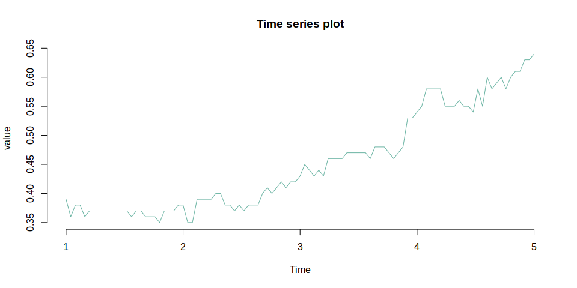<!-- -->

<h4>
Decomposition of time series
</h4>


<p>
Trend:
x_{t+k}}")
</p>
<p>
Seasonality:

</p>
<p>
Residuals:

</p>

``` r
par(mfrow=c(1,2))
value_dec=decompose(value_ts)
plot(value_dec, yax.flip = TRUE,col='#69b3a2',bty='n')
```

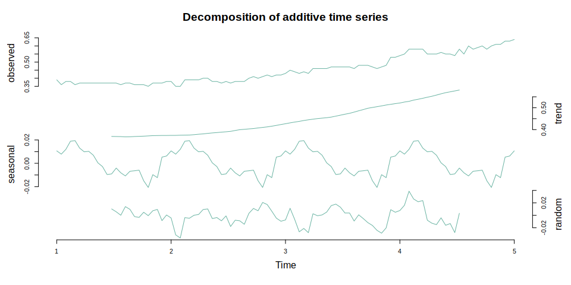<!-- -->

``` r
lambda=BoxCox.lambda(value_ts)
log_ts=BoxCox(value_ts,lambda)
par(mfrow=c(1,2))
value_dec=decompose(log_ts)
plot(value_dec, yax.flip = TRUE,col='#69b3a2',bty='n')
```

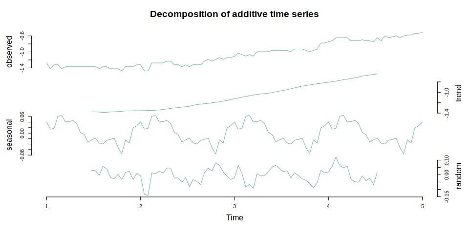<!-- -->

<h4>
Polynomial approach
</h4>

``` r
n=4
par(mfrow=c(2,2))
t=1:length(value_ts)
for (i in 1:n){
  fit_poln=lm(value_ts ~ poly(t,i))
  print(paste('Degree of polynomial: ',i))
  print(paste('adj R squared: ',summary(fit_poln)$adj.r.squared))
  print(paste('AIC: ',AIC(fit_poln)))
  print(paste('BIC: ',BIC(fit_poln)))
  plot(value_ts,ylab='value',col='#69b3a2',bty='n')
  lines(ts(fit_poln$fitted.values,frequency = f,start = a),type="l",col="red",lwd = 1,pch = 10)
}
```

    ## [1] "Degree of polynomial:  1"
    ## [1] "adj R squared:  0.881951949597329"
    ## [1] "AIC:  -420.461933175895"
    ## [1] "BIC:  -412.616571625371"

    ## [1] "Degree of polynomial:  2"
    ## [1] "adj R squared:  0.960069182912771"
    ## [1] "AIC:  -528.965602510792"
    ## [1] "BIC:  -518.505120443427"

    ## [1] "Degree of polynomial:  3"
    ## [1] "adj R squared:  0.965058884548141"
    ## [1] "AIC:  -541.483408670466"
    ## [1] "BIC:  -528.407806086259"

    ## [1] "Degree of polynomial:  4"
    ## [1] "adj R squared:  0.964833905318662"
    ## [1] "AIC:  -539.881814975658"
    ## [1] "BIC:  -524.19109187461"

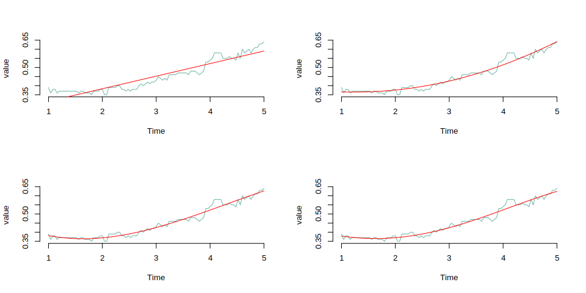<!-- -->

``` r
par(mfrow=c(1,1))
fit_poln=lm(value_ts ~ poly(t,3)) #Selection of the degree of the polynomial
value_pol=ts(value_ts-fit_poln$fitted.values,frequency = f,start = a)
plot.ts(value_pol,col='orange',main='Residuals',ylab='res',bty='n',ylim=c(-r/2,r/2))
```

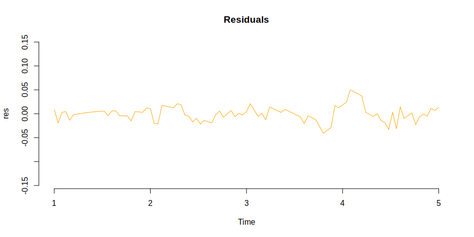<!-- -->

<p>
Based on the provided results, the polynomial of degree 3 seems to
strike a good balance between model complexity and goodness of fit, as
it has a relatively high adjusted R-squared and lower AIC/BIC compared
to higher-degree polynomials.
</p>
<h4>
Box-Jenkins method
</h4>
<h5>
Stagnation check
</h5>

``` r
adf.test(value_ts)  # p<0.05
```

    ## 
    ##  Augmented Dickey-Fuller Test
    ## 
    ## data:  value_ts
    ## Dickey-Fuller = -1.9222, Lag order = 4, p-value = 0.6089
    ## alternative hypothesis: stationary

<p>
The ADF test suggests non-stationarity, but it doesn’t provide strong
evidence.
</p>

``` r
kpss.test(value_ts)  # p>0.05
```

    ## 
    ##  KPSS Test for Level Stationarity
    ## 
    ## data:  value_ts
    ## KPSS Level = 1.9715, Truncation lag parameter = 4, p-value = 0.01

<p>
The KPSS test suggests non-stationarity and provides stronger evidence
against stationarity.
</p>
<h5>
Differences transformation
</h5>
<p>
We apply the difference transformation until the Augmented Dickey-Fuller
Test (adf) gives (p-value&lt;0.05)
</p>

``` r
l=1 # Elimination of seasonality
d=ndiffs(value_ts, test = "adf") # Elimination of trend
value_dif=diff(value_ts,lag=l,differences = d)
plot.ts(value_dif,main='Residuals',ylab='res',col='orange',ylim=c(-r/2,r/2),bty='n')
```

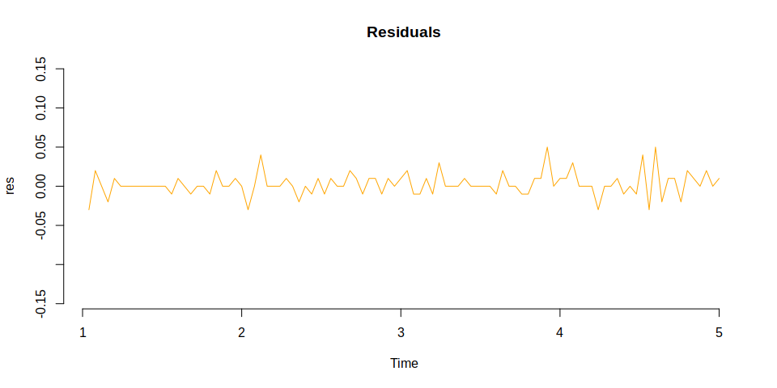<!-- -->

<h5>
Autocorrelation - heteroscedasticity
</h5>

``` r
par(mfrow=c(1,2))
plot(acf(value_ts,plot = F),main = 'Auto-Correlation Function Estimation',col='orange',bty='n')
q=11
plot(pacf(value_ts,plot = F),main = 'Partial Auto-Correlation Function Estimation',col='orange',bty='n')
```

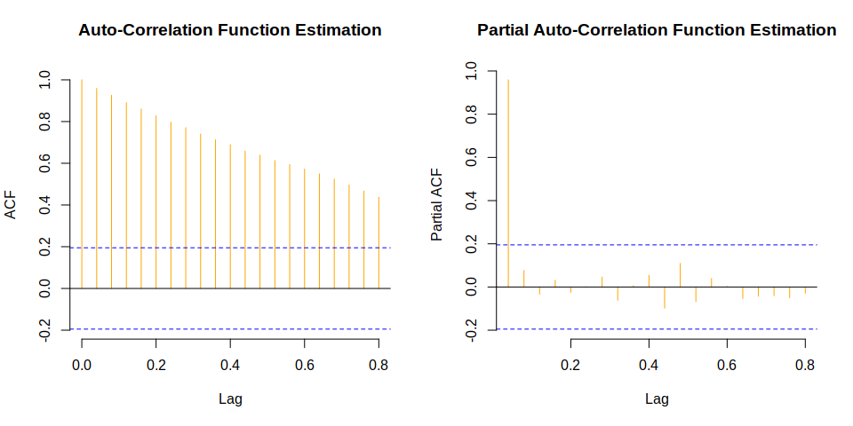<!-- -->

``` r
p=1
```

<h5>
Auto-regressive model (AR(p))
</h5>

``` r
par(mfrow=c(1,2))
fit_ar=arima(value_ts,order = c(p,0,0),method = 'CSS')
value_ar=fitted(fit_ar)
plot.ts(value_ts,ylab='value',main='AR(1) model',col='#69b3a2',bty='n')
lines(value_ar,col='red')
legend('bottomright',legend=c('observed','fitted'), col=c('#69b3a2','red'),pch=c('-','-'),bty='n')
plot.ts(value_ts-value_ar, yax.flip = TRUE,col='orange',main='Residuals',ylim=c(-r/2,r/2),ylab='res',bty='n')
```

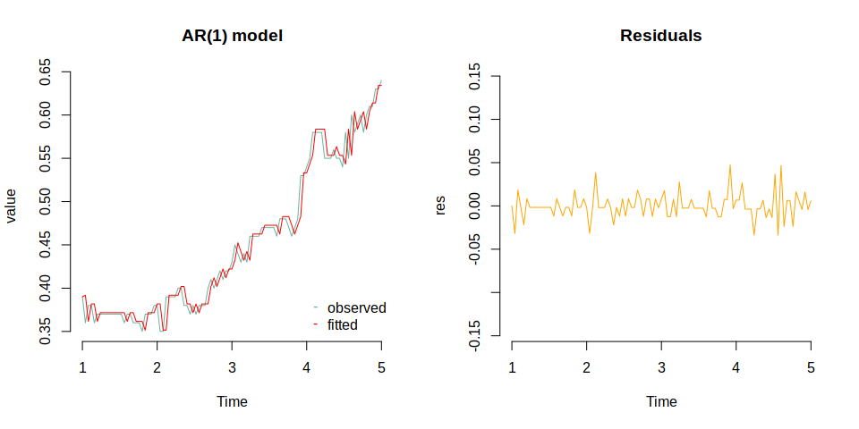<!-- -->

<h5>
Moving Average model (MA(q))
</h5>

``` r
par(mfrow=c(1,2))
fit_ma=arima(value_ts,order = c(0,0,q),method = 'CSS')
value_ma=fitted(fit_ma)
plot.ts(value_ts,ylab='value',main='MA(11) model',col='#69b3a2',bty='n')
lines(value_ma,col='red')
legend('bottomright',legend=c('observed','fitted'), col=c('#69b3a2','red'),pch=c('-','-'),bty='n')
plot.ts(value_ts-value_ma, yax.flip = TRUE,col='orange',main='Residuals',ylab='res',ylim=c(-r/2,r/2),bty='n')
```

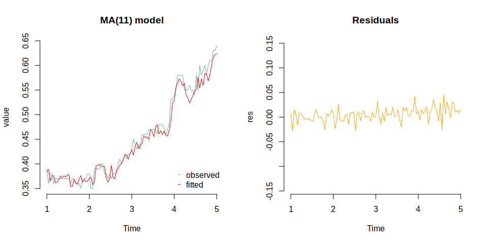<!-- -->

<h5>
Auto-regressive Integrated Moving Average model (ARIMA(p,d,q))
</h5>

``` r
par(mfrow=c(1,2))
fit_arima=arima(value_ts,order = c(p,d,q),method = 'CSS')
value_arima=fitted(fit_arima)
plot.ts(value_ts,ylab='value',main='ARIMA(1,1,11) model',col='#69b3a2',bty='n')
lines(value_arima,col='red')
legend('bottomright',legend=c('observed','fitted'), col=c('#69b3a2','red'),pch=c('-','-'),bty='n')
plot.ts(value_ts-value_arima, yax.flip = TRUE,col='orange',main='Residuals',ylab='res',ylim=c(-r/2,r/2),bty='n')
```

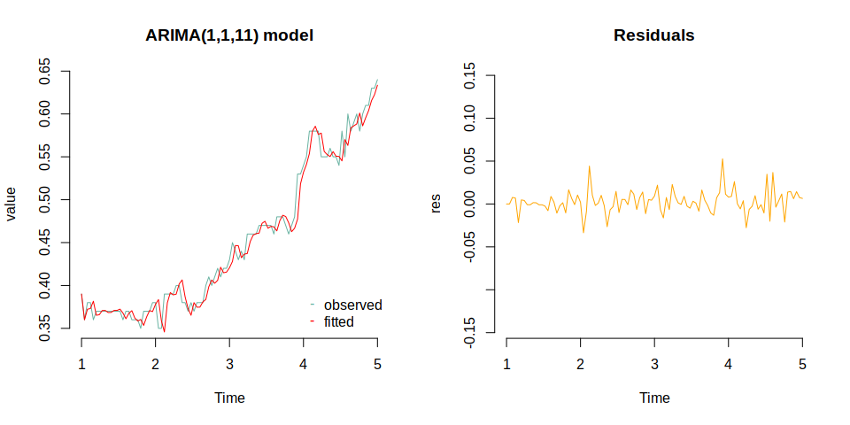<!-- -->

<h5>
Residuals check
</h5>

``` r
checkresiduals(fit_arima)  #h0 independence (p>0.05)
```

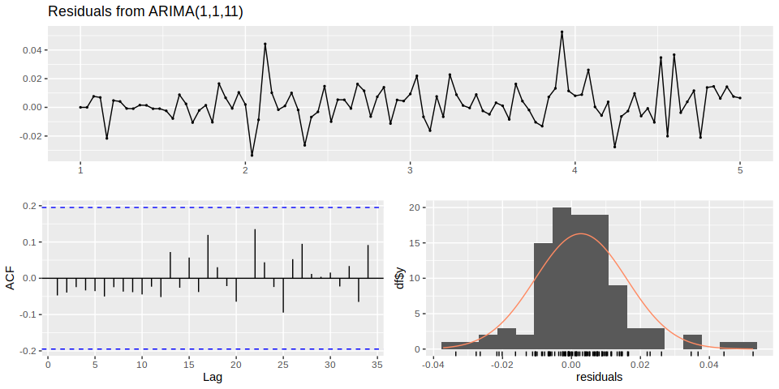<!-- -->

    ## 
    ##  Ljung-Box test
    ## 
    ## data:  Residuals from ARIMA(1,1,11)
    ## Q* = 5.7138, df = 8, p-value = 0.6793
    ## 
    ## Model df: 12.   Total lags used: 20

<h5>
Predictions
</h5>

``` r
frcast=forecast(fit_arima, h = 7)
kable(frcast)
```

|      | Point Forecast |     Lo 80 |     Hi 80 |     Lo 95 |     Hi 95 |
|:-----|---------------:|----------:|----------:|----------:|----------:|
| 5.04 |      0.6429749 | 0.6254552 | 0.6604945 | 0.6161809 | 0.6697688 |
| 5.08 |      0.6434845 | 0.6214674 | 0.6655017 | 0.6098122 | 0.6771568 |
| 5.12 |      0.6470632 | 0.6197958 | 0.6743305 | 0.6053614 | 0.6887650 |
| 5.16 |      0.6443017 | 0.6128249 | 0.6757784 | 0.5961621 | 0.6924412 |
| 5.20 |      0.6436939 | 0.6082746 | 0.6791132 | 0.5895248 | 0.6978630 |
| 5.24 |      0.6450967 | 0.6056249 | 0.6845685 | 0.5847298 | 0.7054636 |
| 5.28 |      0.6442563 | 0.6008445 | 0.6876681 | 0.5778637 | 0.7106489 |

``` r
plot(frcast,main="Prediction",ylab='value',col='#69b3a2',bty='n')
```

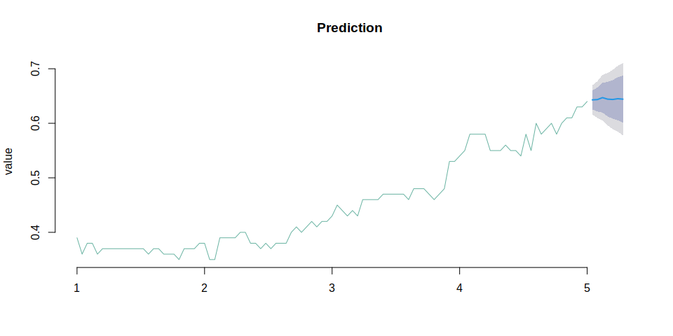<!-- -->

``` r
kable(accuracy(frcast$fitted, data$value))
```

|          |       ME |      RMSE |       MAE |       MPE |     MAPE |
|:---------|---------:|----------:|----------:|----------:|---------:|
| Test set | 0.002737 | 0.0135346 | 0.0095709 | 0.5086794 | 2.107685 |

-   The ME being close to zero suggests that, on average, the forecasts
    are relatively balanced in terms of overestimation and
    underestimation.
-   The RMSE provides an overall measure of the accuracy, with a lower
    value indicating better performance. The value of 0.01353461
    suggests a relatively small typical error in your forecasts.
-   The MAE and MAPE provide additional measures of the average
    magnitude and percentage difference of errors, respectively.
-   The MPE being positive suggests a tendency for overestimation on
    average.
